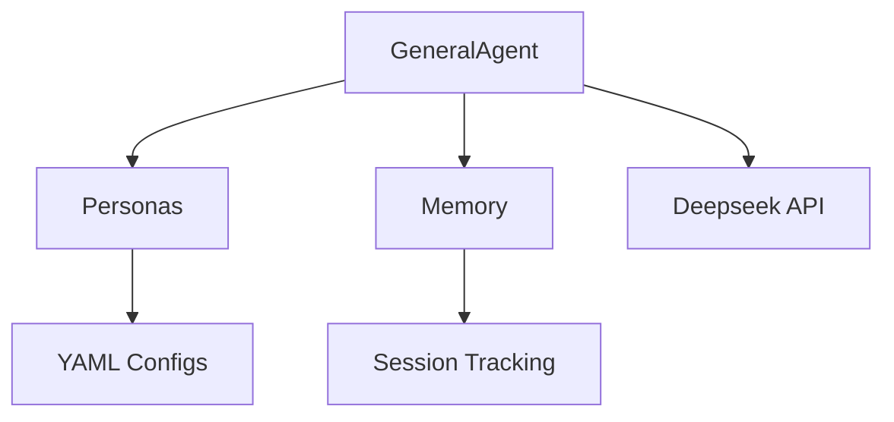

# Agentic Workflows Architecture

## Core Components

### Key Modules:
1. `agents/` - Core agent implementations
   - `general_agent.py`: Main agent class with role support
   - `memory.py`: Conversation history management
2. `personas/` - Behavior configurations
   - YAML files defining role traits/constraints
3. `utils/` - Shared utilities
   - `rate_limiter.py`: API call throttling

## Data Flow
1. User query → Agent.execute()
2. Augmented with persona traits → Deepseek API
3. Response processed → Memory updated
4. Action determined → Returned to caller