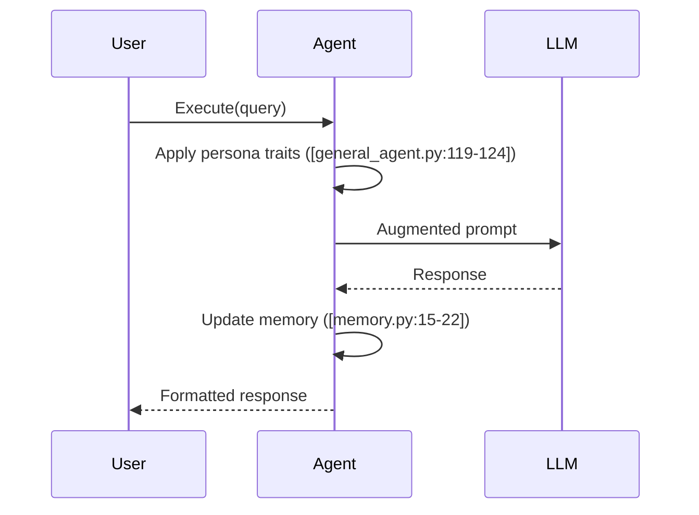

# Key Workflows

## 1. Scenario & Role Assignment Flow
```python
# From [general_agent.py](agents/general_agent.py:62-71)
async def assign_role(self, scenario_name: str, persona_name: str):
    """Load scenario and role configuration from YAML"""
    scenario = self.persona_manager.load_scenario(scenario_name)
    self.current_scenario = scenario
    self.current_persona = scenario.personas[persona_name]
    
    print(f"Assigned {persona_name} role in {scenario_name} scenario")
    print(f"Traits: {self.current_persona['traits']}")
```

### Scenario YAML Structure
```yaml
# From [scenarios/customer_support.yaml](scenarios/customer_support.yaml)
scenario: late_delivery
description: Customer complains about late package delivery

personas:
  support_agent:
    role_type: support
    traits:
      patience: 0.7
      policy_knowledge: 0.9
    allowed_actions:
      - offer_discount
      - escalate
    instructions: |
      You're a Tier 1 support agent. Company policy allows:
      - Max 15% discount
      - Free return shipping
      - No cash refunds

story_arc:
  - trigger: "complaint about lateness"
    expected_responses:
      - apology
      - delivery_check
```

## 2. Query Processing Sequence


## 3. Error Handling
- **Retry Mechanism**: 3 attempts with exponential backoff ([general_agent.py:54-57])
- **Fallback**: Returns minimal confidence response ([general_agent.py:130-136])
- **Validation**: Pydantic models enforce schema ([schemas.py:10-15])

## Example Scenario: Late Delivery Complaint
1. Load customer support scenario
2. Assign support agent persona
3. Check story arc triggers
4. Process customer message
5. Generate response matching expected patterns
6. Progress through story arc
7. Escalate if confidence < threshold or policy violation