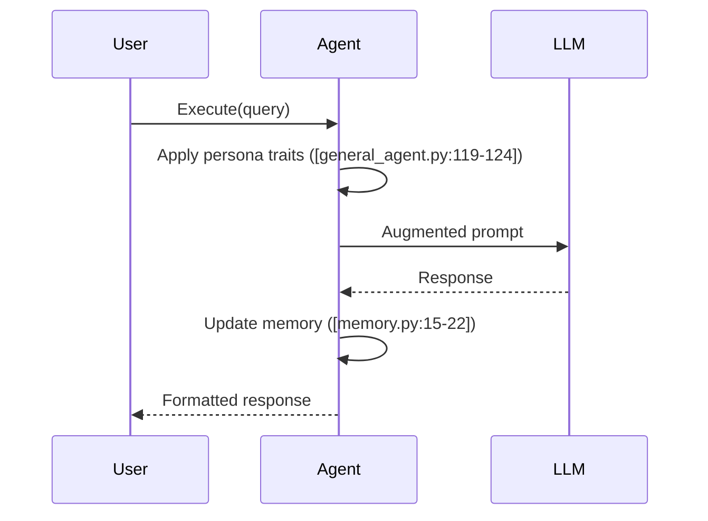

# Key Workflows

## 1. Role Assignment Flow
```python
# From [general_agent.py](agents/general_agent.py:50-55)
async def assign_role(self, scenario: str, persona_name: str):
    """Load role configuration from YAML"""
    filepath = self.persona_dir / f"{scenario}_{persona_name}.yaml"
    with open(filepath) as f:
        data = yaml.safe_load(f)
        self.current_role = RoleConfig(**data)
```

## 2. Query Processing Sequence


## 3. Error Handling
- **Retry Mechanism**: 3 attempts with exponential backoff ([general_agent.py:54-57])
- **Fallback**: Returns minimal confidence response ([general_agent.py:130-136])
- **Validation**: Pydantic models enforce schema ([schemas.py:10-15])

## Example Scenario: Late Delivery Complaint
1. Load support agent persona
2. Process customer message
3. Generate appropriate response
4. Escalate if confidence < threshold